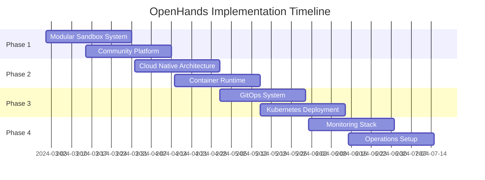
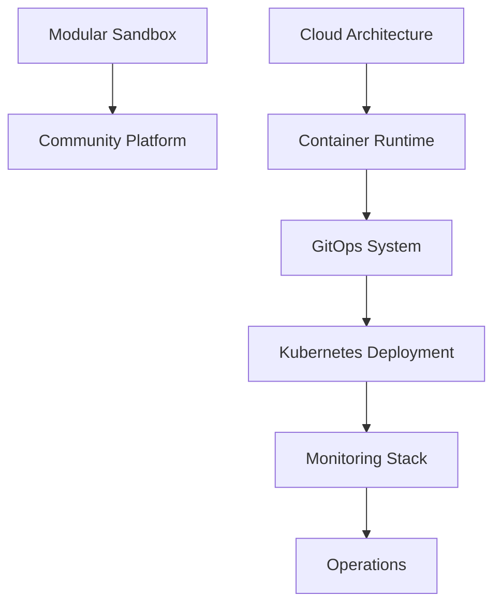

# OpenHands Technical Roadmap

## Overview

This document outlines the technical roadmap for OpenHands, organizing various proposals into a coherent implementation plan.

```
┌──────────────────────────────────────────────────────────────┐
│                   OpenHands Architecture                     │
├──────────────────────────────────────────────────────────────┤
│                                                             │
│  ┌─────────────┐   ┌─────────────┐   ┌─────────────────┐   │
│  │ Development │   │ Deployment  │   │   Production    │   │
│  │ Environment │   │ Pipeline    │   │   Environment   │   │
│  └──────┬──────┘   └──────┬──────┘   └───────┬─────────┘   │
│         │                 │                   │             │
│  ┌──────┴──────┐   ┌─────┴─────┐   ┌────────┴──────────┐  │
│  │  Sandbox    │   │   GitOps   │   │    Container      │  │
│  │  System     │   │   System   │   │    Runtime        │  │
│  └──────┬──────┘   └─────┬─────┘   └────────┬──────────┘  │
│         │                 │                   │             │
│  ┌──────┴──────┐   ┌─────┴─────┐   ┌────────┴──────────┐  │
│  │ Community   │   │ Monitoring │   │     Cloud         │  │
│  │  Platform   │   │   Stack    │   │   Infrastructure  │  │
│  └─────────────┘   └───────────┘   └─────────────────────┘ │
└──────────────────────────────────────────────────────────────┘
```

## Phase 1: Development Environment (Months 1-2)

### 1. Modular Sandbox System
- [Proposal: Modular Sandboxes](technical/modular-sandboxes.md)
- [Proposal: Development Sandbox](technical/dev-sandbox.md)
- Status: Planning
- Priority: High
- Dependencies: None

Key Features:
- Nix-based configuration
- Language-specific environments
- Tool management
- Community recipes

### 2. Community Platform
- [Proposal: Sandbox CI/CD and Community](technical/sandbox-cicd-community.md)
- Status: Planning
- Priority: Medium
- Dependencies: Modular Sandbox System

Key Features:
- Recipe exchange
- Community hub
- Analytics system
- Governance model

## Phase 2: Cloud Infrastructure (Months 2-3)

### 1. Cloud Native Architecture
- [Proposal: CNCF Architecture](technical/cncf-architecture.md)
- [Proposal: Crossplane Multicloud](technical/crossplane-multicloud.md)
- Status: Planning
- Priority: High
- Dependencies: None

Key Features:
- CNCF project integration
- Multi-cloud support
- Container orchestration
- Storage solutions

### 2. Container Runtime
- [Proposal: Runtime Containers](technical/runtime-containers.md)
- Status: Planning
- Priority: High
- Dependencies: Cloud Native Architecture

Key Features:
- Container components
- Storage architecture
- Resource management
- Performance optimization

## Phase 3: Deployment Pipeline (Months 3-4)

### 1. GitOps System
- [Proposal: ArgoCD GitOps](technical/argocd-gitops.md)
- Status: Planning
- Priority: High
- Dependencies: Cloud Infrastructure

Key Features:
- ArgoCD integration
- Multi-cluster management
- Automated sync
- Deployment strategies

### 2. Kubernetes Deployment
- [Proposal: Kubernetes Deployment](technical/kubernetes-deployment.md)
- Status: Planning
- Priority: High
- Dependencies: GitOps System

Key Features:
- Cluster configuration
- Resource management
- Service mesh
- Security policies

## Phase 4: Monitoring and Operations (Months 4-5)

### 1. Monitoring Stack
- [Proposal: Monitoring Stack](technical/monitoring-stack.md)
- Status: Planning
- Priority: Medium
- Dependencies: Deployment Pipeline

Key Features:
- Metrics collection
- Distributed tracing
- Log aggregation
- Alerting system

### 2. Implementation Roadmap
- [Proposal: Implementation Roadmap](technical/implementation-roadmap.md)
- Status: In Progress
- Priority: High
- Dependencies: None

Key Features:
- Project timeline
- Resource allocation
- Milestone tracking
- Risk management

## Timeline



## Dependencies



## Success Metrics

### 1. Development Environment
- Sandbox creation time < 5 minutes
- Recipe success rate > 95%
- Community engagement > 100 active users
- Recipe library > 50 recipes

### 2. Cloud Infrastructure
- Deployment success rate > 99%
- Resource utilization > 80%
- Cross-cloud deployment < 10 minutes
- Service availability > 99.9%

### 3. Deployment Pipeline
- Deployment frequency > 10/day
- Change failure rate < 5%
- Mean time to recovery < 30 minutes
- Automated test coverage > 90%

### 4. Monitoring and Operations
- Alert accuracy > 95%
- Mean time to detect < 5 minutes
- Log coverage > 95%
- Dashboard availability > 99.9%

## Risk Management

### 1. Technical Risks
- Complex multi-cloud setup
- Integration challenges
- Performance bottlenecks
- Security vulnerabilities

Mitigation:
- Thorough testing
- Gradual rollout
- Security audits
- Performance monitoring

### 2. Operational Risks
- Resource constraints
- Knowledge gaps
- Timeline delays
- Dependency issues

Mitigation:
- Clear documentation
- Training programs
- Agile methodology
- Regular reviews

### 3. Community Risks
- Low adoption
- Poor engagement
- Quality issues
- Support overhead

Mitigation:
- Community outreach
- Quality guidelines
- Automation tools
- Support documentation

## Next Steps

### Immediate Actions (Next 2 Weeks)
1. Finalize sandbox architecture
2. Begin Nix configuration
3. Set up CI/CD pipeline
4. Create documentation

### Short Term (1-2 Months)
1. Launch community platform
2. Deploy cloud infrastructure
3. Implement monitoring
4. Begin testing

### Medium Term (3-6 Months)
1. Scale deployment pipeline
2. Enhance monitoring
3. Grow community
4. Optimize performance

### Long Term (6+ Months)
1. Expand cloud support
2. Add advanced features
3. Build ecosystem
4. Improve automation